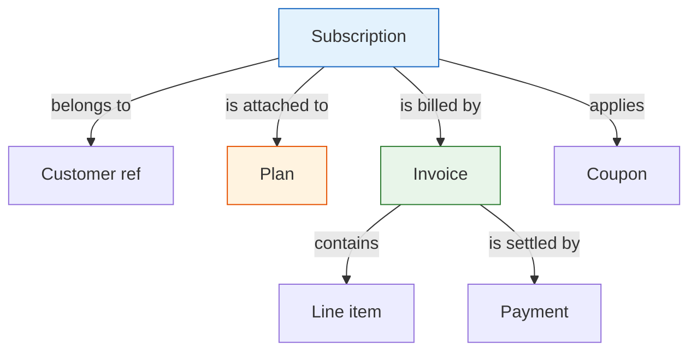
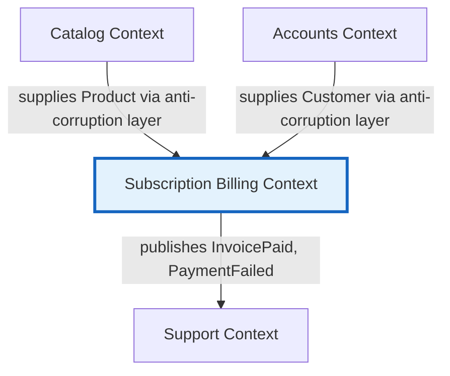

# Subscription Billing Ontology

The agreed-upon model for the **Subscription Billing** bounded context. It is the single source of truth for what each concept means, how concepts are classified, which rules hold them together, and where this context touches its neighbors.

Companion to [How Do I Create a Software Ontology?](https://jeffbailey.us/blog/2026/05/28/how-do-i-create-a-software-ontology). The machine-readable form lives in [`ontology.yaml`](ontology.yaml).

## The context

**Subscription Billing** owns recurring payment. It turns a customer's chosen plan into invoices on a fixed cadence, collects payment, and retries failed charges. It does not own the product catalog, the customer record, or support; those are neighboring contexts, mapped at the seams below.

One sentence: *Subscription Billing charges customers, on a schedule, for the plan they subscribed to.*

## Ubiquitous language

Every term the team uses, defined once. Code, tables, and API fields use these names, spelled this way.

- **Subscription**: a recurring agreement for one customer to pay for access to one plan on a fixed cadence.
- **Plan**: the priced offering a subscription is attached to, including its cadence and seat limit.
- **Seat**: one unit of paid access within a subscription. A plan caps how many a subscription may hold.
- **Invoice**: a demand for payment covering exactly one billing period of one subscription.
- **Line item**: one charge on an invoice, such as a base fee or a per-seat charge.
- **Billing period**: the date range an invoice covers, derived from the plan's cadence.
- **Money**: an amount paired with a currency. Two Money values are equal when amount and currency match.
- **Payment**: a recorded attempt to settle an invoice through a payment method.
- **Payment method**: the stored instrument (card, bank account) a payment draws from.
- **Dunning**: the retry-and-notify process that runs after a payment fails.
- **Coupon**: a named, time-bound reduction applied to a subscription's invoices.
- **Product** *(neighbor)*: the richer catalog concept a Plan is a billing-facing slice of. Owned by the Catalog context.
- **Customer** *(neighbor)*: the account a subscription belongs to. Owned by the Accounts context.

## Concept classification

Each concept is an entity (distinct identity that persists through change), a value object (defined by its attributes, immutable, interchangeable when equal), or a domain event (something that happened).

### Entities

- **Subscription**: same subscription across plan changes, seat changes, and cancellation.
- **Invoice**: same invoice even after its status moves from open to paid to void.
- **Plan**: same plan as its price and limits are revised over time.
- **Payment**: same recorded attempt regardless of its later status.
- **Coupon**: same coupon as its redemption count changes.

### Value objects

- **Money**: amount plus currency, immutable.
- **Billing period**: a start and end date, immutable.
- **Seat**: identity-free within a subscription; counted, not tracked individually.
- **Line item**: a description plus a Money amount, immutable once the invoice is issued.
- **Payment method**: a reference token plus display metadata, immutable.

### Domain events

- **PaymentFailed**: a payment attempt did not settle.
- **InvoicePaid**: an invoice reached a fully paid state.
- **DunningStarted**: retry-and-notify began for an unpaid invoice.
- **SubscriptionCanceled**: a subscription will not renew.

## Aggregates

Three aggregates, each with one root, the members it contains, and the single invariant that must hold whenever a transaction commits. Aggregates reference each other by identity, never by object.

### Subscription (root: Subscription)

- **Contains**: its seats, its applied coupon.
- **References by identity**: `Plan`, `Customer`.
- **Invariant**: the number of active seats never exceeds the seat limit of the plan it is attached to.

### Invoice (root: Invoice)

- **Contains**: its line items, its payments, its billing period.
- **References by identity**: `Subscription`.
- **Invariant**: the line items sum exactly to the invoice total, and the invoice covers exactly one billing period.

### Plan (root: Plan)

- **Contains**: its price (Money), its cadence, its seat limit.
- **References by identity**: `Product`.
- **Invariant**: price is non-negative and the seat limit is at least one.

## Relationship model

How the aggregates relate, read as sentences in the ubiquitous language. Every edge has a verb.

Read as:

- A subscription belongs to one customer and is attached to one plan.
- Many invoices bill a subscription, one per billing period.
- An invoice contains one or more line items and is settled by zero or more payments.

## Context map

Where Subscription Billing meets its neighbors, the direction of dependency, and the integration pattern at each seam.

Read as:

- Catalog and Accounts are upstream suppliers. Billing translates their richer `Product` and `Customer` models into its own `Plan` and `Customer` reference through an anti-corruption layer, so churn in a neighbor does not leak into the billing model.
- Support is downstream. It consumes the `InvoicePaid` and `PaymentFailed` events Billing publishes, and depends on Billing rather than the reverse.

## How to verify this model

The ontology is working when each of these holds:

- A domain expert reads the glossary and corrects wording without asking what a term means in code.
- Every class, table, and API field name appears in the glossary, spelled the same way.
- Each aggregate's invariant reads as one true sentence.
- Each relationship edge reads as a true sentence in the ubiquitous language.
- A new engineer can answer "where does this concept live and what owns it?" from this file alone.
